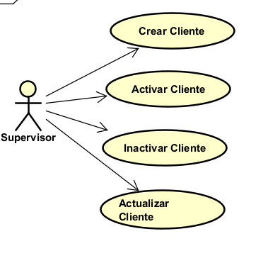
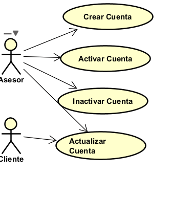

# 📄 Requerimientos del Sistema

## 1. Lista general de requerimientos

El sistema de Bankify tiene los siguientes requerimientos (descripción a alto nivel):

### 1.1 Requerimientos funcionales

El sistema de Bankify debe tener la capacidad de:

1.El sistema debe permitir la autenticación de usuarios con usuario y contraseña para        operadores y clientes.
2.El sistema debe permitir crear, activar, inactivar y actualizar información de clientes por supervisores.
3.El sistema debe permitir crear, activar, inactivar y actualizar información de cuentas bancarias por asesores y clientes (limitado).
4.El sistema debe permitir consultar el saldo de una cuenta por el cliente propietario.
5.El sistema debe generar reportes tributarios en PDF para clientes individuales.

### 1.2 Requerimientos no  funcionales

El sistema de Bankify debe tener:

1.El número de cuenta debe tener exactamente 10 dígitos numéricos sin caracteres especiales. 
2.Los dos primeros dígitos del número de cuenta deben representar un banco registrado en el sistema.
3.Los reportes deben generarse en formatos específicos: PDF para clientes y JSON para DIAN.
4.El sistema debe ser sencillo y seguro para interacción de clientes.
5.El sistema debe garantizar seguridad en las operaciones mediante autenticación.

## 2. Diagramas de caso de uso

### 2.1 Requerimiento Funcional 1

| Campo | Descripción |
|------|-------------|
| **ID** | RF-01 |
| **Nombre del requerimiento** | Autenticación de usuarios |
| **Descripción** | El sistema debe permitir la autenticación de usuarios con usuario y contraseña para operadores y clientes. |
| **Precondiciones** | Para que el sistema cumpla con este requerimiento, Bankify debe tener previamente registrados los usuarios (operadores y clientes) en el sistema con sus respectivas credenciales. |
| **Actor** | Operador, Cliente |
| **Flujo principal** | 1. El actor ingresa su nombre de usuario y contraseña en el sistema. 2. El sistema valida las credenciales del usuario. 3. El sistema autentica al usuario y le otorga acceso a las funcionalidades correspondientes a su rol. |
| **Diagrama de caso de uso** | **|
| **Poscondiciones** | Se espera como resultado que el usuario sea autenticado correctamente y pueda acceder a las funcionalidades del sistema según su rol (operador o cliente). |

### 2.2 Requerimiento Funcional 2

| Campo | Descripción |
|------|-------------|
| **ID** | RF-02 |
| **Nombre del requerimiento** | Gestión de información de clientes |
| **Descripción** | El sistema debe permitir crear, activar, inactivar y actualizar información de clientes por supervisores. |
| **Precondiciones** | Para que el sistema cumpla con este requerimiento, Bankify debe tener previamente un supervisor autenticado en el sistema con los permisos necesarios para gestionar clientes. |
| **Actor** | Supervisor |
| **Flujo principal** | 1. El supervisor selecciona la opción de gestión de clientes en el sistema. 2. El sistema presenta las opciones de crear, activar, inactivar o actualizar información de clientes. 3. El supervisor realiza la operación deseada y el sistema registra los cambios en la información del cliente. |
| **Diagrama de caso de uso** | **|
| **Poscondiciones** | Se espera como resultado que la información del cliente sea creada, activada, inactivada o actualizada correctamente en el sistema según la operación realizada por el supervisor. |

### 2.3 Requerimiento Funcional 3

| Campo | Descripción |
|------|-------------|
| **ID** | RF-03 |
| **Nombre del requerimiento** | Gestión de cuentas bancarias |
| **Descripción** | El sistema debe permitir crear, activar, inactivar y actualizar información de cuentas bancarias por asesores y clientes (limitado). |
| **Precondiciones** | Para que el sistema cumpla con este requerimiento, Bankify debe tener previamente asesores autenticados con permisos para gestionar cuentas bancarias, y clientes autenticados con permisos limitados para actualizar su propia información de cuenta. |
| **Actor** | Asesor, Cliente |
| **Flujo principal** | 1. El actor selecciona la opción de gestión de cuentas bancarias en el sistema. 2. El sistema presenta las opciones disponibles según el rol del actor (todas las operaciones para asesores, operaciones limitadas para clientes). 3. El actor realiza la operación deseada y el sistema registra los cambios en la información de la cuenta bancaria. |
| **Diagrama de caso de uso** | **|
| **Poscondiciones** | Se espera como resultado que la información de la cuenta bancaria sea creada, activada, inactivada o actualizada correctamente en el sistema según la operación realizada y los permisos del actor. |

## 3. Preguntas
a. ¿Identifica algún requerimiento que deba detallarse más? ¿cuál(es)?
    RF-03 (Gestión de cuentas bancarias): Dice que los clientes tienen permisos "limitados" pero no especifica cuáles operaciones pueden hacer exactamente. ¿Pueden solo actualizar datos personales? ¿Pueden activar/inactivar sus propias cuentas?

    RF-04 (Consultar saldo): Solo menciona consultar el saldo, pero no aclara si el cliente puede ver el historial de movimientos, últimas transacciones o solo el saldo actual.

    RF-05 (Reportes tributarios): No especifica qué información debe incluir el reporte, ni con qué periodicidad se genera (mensual, anual, bajo demanda).

    RNF-03: Menciona que se deben generar reportes en JSON para la DIAN, pero no existe un requerimiento funcional que explique cómo y cuándo se generan estos reportes para la entidad tributaria.
b. ¿Requerimientos que se contradigan?
    RF-05 vs RNF-03: El requerimiento funcional 5 solo habla de generar reportes en PDF para clientes individuales, mientras que el no funcional 3 menciona también generar reportes en JSON para la DIAN. Falta aclarar si son dos tipos de reportes diferentes o si se genera el mismo reporte en dos formatos.

c. ¿2 requerimientos más importantes para la primera iteración?
    -01 (Autenticación de usuarios): Es la base de todo. Sin poder ingresar al sistema, ninguna otra funcionalidad sirve. Es como la puerta de entrada.

    RF-04 (Consultar saldo): Es la necesidad más básica y común de cualquier cliente. Ver cuánto dinero tiene en su cuenta es lo mínimo que esperaría poder hacer en un sistema bancario.

d. ¿Algún requerimiento que no debería realizarse?
    Ninguno. Todos los requerimientos parecen necesarios y razonables para un sistema bancario básico. Sin embargo, si hubiera restricciones de tiempo o presupuesto, el RF-05 (reportes tributarios) podría dejarse para una segunda fase, ya que los reportes tributarios generalmente se solicitan pocas veces al año, mientras que las demás funcionalidades se usan diariamente.